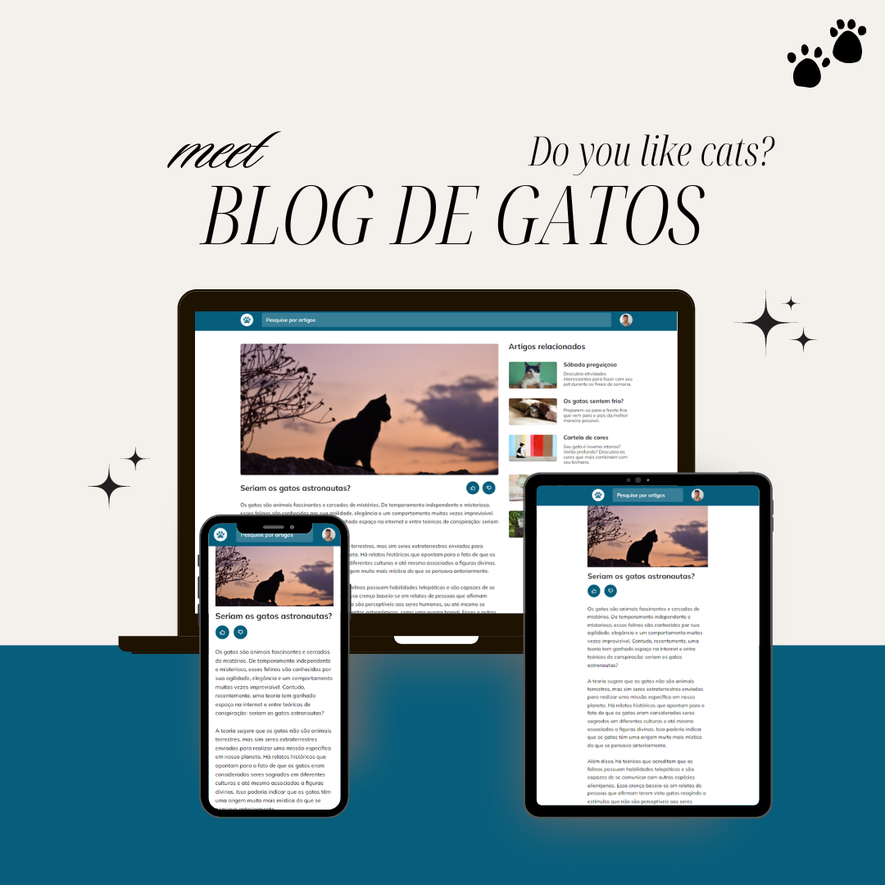

<h1 align="center"> Blog de gatos </h1>

  <a href="#-tecnologias">Tecnologias</a>&nbsp;&nbsp;&nbsp;|&nbsp;&nbsp;&nbsp;
  <a href="#-projeto">Projeto</a>&nbsp;&nbsp;&nbsp;|&nbsp;&nbsp;&nbsp;
  <a href="#-layout">Layout</a>&nbsp;&nbsp;&nbsp;&nbsp;&nbsp;&nbsp;

 

  

## 🚀 Tecnologias

Esse projeto foi desenvolvido com as seguintes tecnologias:

- HTML e CSS
- Git e Github
- Figma

Aprendizados:
- Media Queries
- Responsividade
- Root EM
- Mobile First
- O uso de css animation
- Grid

## 💻 Projeto

Neste projeto Rocketseat foi feito um blog com o tema "Blog de gatos" para desktop e mobile, com o intuito de estudar fundamentos sobre responsividade em diferentes dispositivos e customização com html e css, e varias formas de usar o grid template, onde, foi desafiado a reprodução de um layout pelo figma com os conceitos aprendidos em aula. Espero que gostem!

- [Acesse o projeto finalizado, online](https://luriserdan.github.io/Cheesecake/)

## 🔖 Layout

Você pode visualizar o layout do projeto através [DESSE LINK](https://www.figma.com/design/1zvilruT452BWZwNMf6wdN/Blog-de-Gatos-%E2%80%A2-Desafio-Explorer-(Community)?node-id=101-91&node-type=CANVAS&t=Z1ddJANGE8o2oxa8-0). É necessário ter conta no [Figma](https://figma.com) para acessá-lo.

Feito com ♥ by Luri Serdan